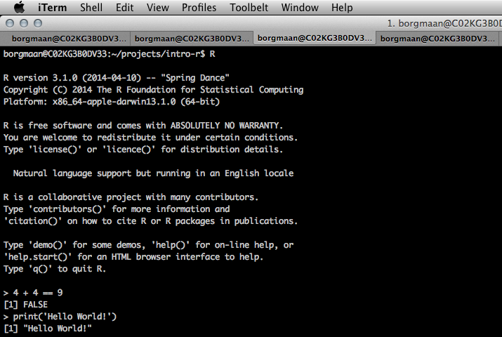
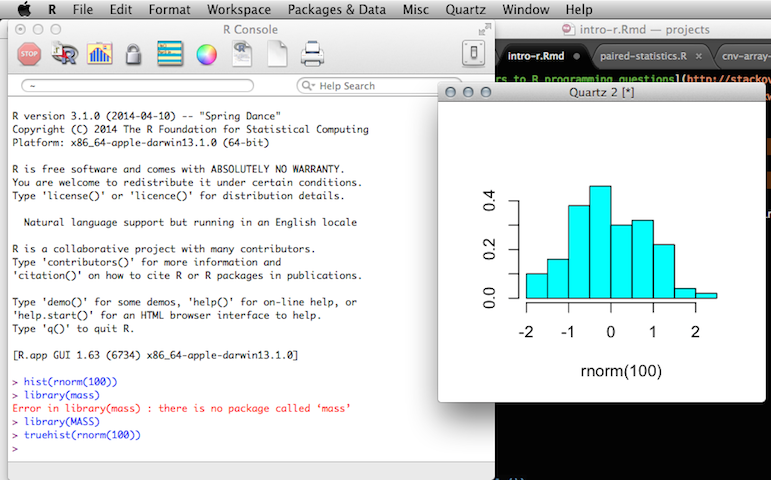

```{r config, echo=FALSE, message=FALSE, eval=TRUE}
library(knitr)
opts_chunk$set(results="hide", message=FALSE, fig.show="hide", fig.align="center", tidy=TRUE)
```

-----


# Disclaimer 

## *Document is still a work in progress*


-----


# External Resources

Such a short tutorial cannot cover the vast *R* universe in much detail. Fortunately, one of the greatest things about *R* is the vibrant community supporting it. One can find endless tutorials, books, presentations, etc. on just about any aspect of *R* you want -- from beginner topics to advances matters. Once you have some familiarity with *R*, you'll be able to "Google your way out" of most problems you run into. Here's a small list of useful resources:

* [RStudio provides many online learning resources](http://www.rstudio.com/resources/training/online-learning/)
* [And even more helpful links buried in an RStudio wiki page](https://support.rstudio.com/hc/en-us/articles/200552336-Getting-Help-with-R)
* [Code School has an excellent tutorial to help you get acquainted with R](http://tryr.codeschool.com/) 
* [StackOverflow is a great place to find answers to R programming questions](http://stackoverflow.com/questions/tagged/r)
* [Google Developers intro to R video tutorials](https://www.youtube.com/watch?v=iffR3fWv4xw&list=PLOU2XLYxmsIK9qQfztXeybpHvru-TrqAP)


-----


# Brief Intro To RStudio & R Concepts

### The R Console

*R* was initially developed to be an *interactive* computing language -- meaning users manually enter commands into an *R* *console* to produce a result. Interactive computing is a great way to investigate data sets and perform [exploratory data analysis](http://en.wikipedia.org/wiki/Exploratory_data_analysis). This is one of the main reasons for *R*'s popularity in the scientific community. 

The *R* console can be accessed in a number of ways:

1. From a command prompt/terminal:



2. From the *R* GUI distribution downloaded with *R*:



3. And, of course, from RStudio:


* Show how to load data without using `read.table()`
* Show how to change directory without using `getwd()`
    - also introduce to working directory
* Show how to install packages without `install.packages()`
	- In

### R Packages

Packages are what make *R* so great. Packages allow *R* users to develop and **share** new code to extend the language -- e.g. implementing a new statistical model for analyzing microarrays, creating an awesome new graph to show copy number alterations in tumor samples, etc. *R* has become the *lingua franca* for statisticians developing new statistical techniques and has been widely adopted in the bioinformatics community ([Bioconductor](http://bioconductor.org/)).

#### CRAN

Most generic *R* packages are hosted on the Comprehensive *R* Archive Network [CRAN](http://cran.us.r-project.org/). To install one of these packages, you would use `install.packages("packagename")`. You only need to install a package once, then load it each time using `library(packagename)`. Here's how one would install and load the `ggplot2` package.

```{r, eval=FALSE}
# Install only once.
install.packages("ggplot2")

# Load the package every time you want to use it.
library(ggplot2)
```

#### Bioconductor

Bioconductor packages work a bit different, and are not hosted on CRAN. More info about the Bioconductor project can be found on its [home page](http://bioconductor.org/). To use any Bioconductor package, you'll need a few "core" Bioconductor packages. Run the following commands to (1) download the installer script, and (2) install some core Bioconductor packages. You'll need internet connectivity to do this, and it'll take a few minutes, but it only needs to be done once.

```{r, eval=FALSE}
# Download the installer script
source("http://bioconductor.org/biocLite.R")

# biocLite() is the bioconductor installer function. Run it without any
# arguments to install the core packages or update any installed packages. This
# requires internet connectivity and will take some time!
biocLite()
```

To install specific packages, first download the installer script if you haven't done so, and use `biocLite("packagename")`. This only needs to be done once then you can load the package like any other package. Let's download the [DESeq2 package](http://www.bioconductor.org/packages/release/bioc/html/DESeq2.html):

```{r, eval=FALSE}
# Do only once
source("http://bioconductor.org/biocLite.R")
biocLite("DESeq2")

# Every time you need to use the DESeq2 package
library(DESeq2)
```

---


# R Calculator

In it's most basic form, *R* can be used as a glorified calculator. Enter the following commands into your *R* console or send them to the console from a script with CMD+Enter on OS X or Ctrl+Enter on Windows.

```{r}
2+2
5*4
2^3
```

It is also smart enough to understand order of operations :)

```{r}
2+3*4/(5+3)*15/2^2+3*4^2
```

# R Data Types

In addition to knowing about numbers, *R* knows about a lot of others things too. 


### /Words/Characters

```{r}
"k"
"hi"
"i love r so much"
```

### Numbers -- Integers & 

```{r}
"k"
"hi"
"i love r so much"
```


### Functions

*R* has built-in functions.

```{r}
# Notice that this is a comment.
# Anything behind a # is "commented out" and is not run.
sqrt(144)
log(1000)
```

Get help by typing a question mark in front of the function's name, or `help(functionname)`:

```
help(log)
?log
```

Note syntax highlighting when typing this into the editor. Also note how we pass *arguments* to functions. Finally, see how you can *next* one function inside of another (here taking the square root of the log-base-10 of 1000).

```{r}
log(1000)
log(1000, base=10)
sqrt(log(1000, base=10))
```

### Vectors

Let's create some numeric vectors. Vectors (aka "arrays" in Perl, "lists" in Python) are single *objects* containing an ordered collection of *elements*. A simple vector is a numeric vector, a single *object* containing several numbers. Here let's display a few vectors. We can also do vector arithmetic. When printing vectors to the screen that have lots of elements, notice that the bracketed number in the gutter of the output is just a counter indexing the number of elements in the vector.

```{r, eval=FALSE}
# Some simple numeric vectors:
1:5
6:10
1:5 + 6:10
1:100
```

We can also create arbitrary vectors with the `c()` function (short for "combine").

```{r}
c(1,2,5)
c(1:5, 11:15)
```

What if we wanted to create a vector from 2 to 10 by 2's? What about 2 to 200 by 4's? This might be useful for setting up an experiment where every other sample is an experimental group and every other is a control.

```{r, eval=FALSE}
c(2,4,6,8,10)

# Get some help with the seq() function, then create a vector from 2 to 200 by 2s.
# Notice how the seq() function works -- the `to` argument will never be exceeded.
help(seq)
seq(from=2, to=200, by=4)
```

### Variables / objects

You can store values in a variable or object. Use the `<-` operator for assignment. `=` also will work, but `<-` is conventional and preferred. Objects should start with a letter and can include numbers and underscores. Named variables are objects containing whatever is assigned to them. Remember, *everything is an object*.

```{r}
x <- 5
x

y <- 42
y

y-x
z <- y-x
z

x <- 1:5
y <- 6:10
x
y
x+y
x*y
x^y
```

You can see what objects (variables) are stored by viewing the Environment tab in Rstudio. You can also use the `ls()` function. You can remove objects (variables) with the `rm()` function. You can do this one at a time or remove several objects at once.

```{r}
ls()
rm(x)
ls()
rm(y,z)
```

### Classes: everything is an object

Use the `class()` function to see what *kind* of object a something is. You can run `class()` on constants, built-in objects, or objects you create. Let's create a character object and then get it's class.

```{r}
class(42)
class(log)
name <- "Stephen"
name
class(name)
```

We can combine values into a vector with the built-in `c()` function.

```{r}
# Get some help with ?c
x <- c(1,3,5)
x
class(x)
length(x)
```

Let's create and manipulate a character vector:


Try running the built-in `sum()` function on a numeric vector:

```{r}
sum(x)
```

Combining characters with numerics results in coercing everything to be a character class.


Certain functions only operate on certain classes. You can't compute the `sum()` of a character vector!


### Slicing/indexing vectors

Let's create a vector of 50 integers going from 101 to 150. We can access certain elements of that vector by putting the element's *index(es)* in square brackets. E.g., `x[1]` will return the first element in vector `x`. Calling `x[c(3,5)]` will access the third and fifth elements. Calling `x[1:10]` will return the first ten elements of `x`.

*Special note: R indexes vectors starting at 1. This is different from many other languages, including Perl and Python, which index starting from zero.*

```{r}
# Create the vector.
x <- 101:150

# Get the first element.
x[1]

# Get the 42nd element.
x[42]

# Get the 20th through the 25th elements.
x[20:25]

# If you try to access elements that don't exist, you'll return missing values.
# Missing values are represented as NA
x[45:55] #NA is missing value!
```

### Data Frames

Data frames are a standard way to store heterogeneous tabular data in R: tabular, meaning that individuals or observations are typically represented in rows, while variables or features are represented as columns; heterogeneous, meaning that columns/features/variables can be different classes (on variable, e.g. age, can be numeric, while another, e.g., cause of death, can be text).

Later on we'll go over how we load our own data, but for now, let's use a built-in data frame called `mtcars`. This data was extracted from the 1974 Motor Trend US magazine, and comprises fuel consumption and 10 aspects of automobile design and performance for 32 automobiles (1973–74 models). We can load this built-in data with `data(mtcars)`. By the way, running `data()` without any arguments will list all the available built-in datasets included with R.

Let's load the data first. Type the name of the object itself (`mtcars`) to view the entire data frame. *Note: doing this with large data frames can cause you trouble.*

```{r}
data(mtcars)
class(mtcars)
mtcars
```

There are several built-in functions that are useful for working with data frames.
* `head()` prints the first few lines of a large data frame.
* `length()` tells you the number of features (variables, columns) in a data frame.
* `dim()` returns a two-element vector containing the number of rows and the number of columns in a data frame.
* `str()` displays the structure of a data frame, printing out details and a preview of every column.
* `summary()` works differently depending on what kind of object you pass to it. Passing a data frame to the `summary()` function prints out some summary statistics about each column (min, max, median, mean, etc.)

```{r}
head(mtcars)
length(mtcars)
dim(mtcars)
dim(mtcars)[1] # number of rows (individual cars in the survey)
dim(mtcars)[2] # number of columns (number of variables measured)
str(mtcars)
```

We can access individual variables within a data frame using the `$` operator, e.g., `mydataframe$specificVariable`. Let's print out the number of cylinders for every car, and calculate the average miles per gallon for ever car in the dataset (using the built-in `mean()` function).

```{r}
# display the number of cylinders for each car.
mtcars$cyl
# first display MPG for all vehicles, then calculate the average.
mtcars$mpg
mean(mtcars$mpg)
```

We can also access certain rows or columns of a dataset by providing multiple indices using the syntax `mydataframe[rows, columns]`. Let's get the first 4 rows and the first two rows (MPG and # cylinders) from the dataset:

```{r}
head(mtcars)
mtcars[1:4, 1:2]
```

We can also use the `subset()` function to return a subset of the data frame that meets a specific condition. The first argument is the data frame you want to subset. The second argument is a condition you must satisfy. If you want to satisfy *all* of multiple conditions, you can use the "and" operator, `&`. The "or" operator `|` (the pipe character, usually shift-backslash) will return a subset that meet *any* of the conditions.

The commands below will:

0. Return only cars with 6 cylinder engines.
0. Return only cars with greater than 6 cylinders.
0. Return only the cars that get at least 20 miles per gallon or have a displacement volume of less than 100cc.
0. Return cars with 6 cylinder engines, but using the `select=` argument, only the MPG and displacement columns. Note the syntax there -- we're passing a vector of variables created with the `c()` function to the `select=` argument, which only returns certain columns.
0. Return cars that have greater than or equal to 6 cylinders *and* get at least 15 miles per gallon, but display only the MPG, cylinders, and qsec columns (qsec is the 1/4 mile time).

Try some subsetting on your own.

```{r}
subset(mtcars, cyl==6)
subset(mtcars, cyl>6)
subset(mtcars, mpg>=20 | disp<100)
subset(mtcars, cyl==6, select=c(mpg, disp))
subset(mtcars, cyl>=6 & mpg>=15, select=c(mpg, cyl, qsec))
```

The `with()` function is particularly helpful. Let's say you wanted to compute some (senseless) value by computing the MPG times the number of cylinders divided by the car's displacement. You could access the dataset's variables using the `$` notation, or you could use `with()` to temporarily *attach* the data frame, and call the variables directly. The first argument to `with()` is the name of the data frame, and the second argument is all the stuff you'd like to do with the particular features in that data frame.

Try typing the following commands:

```{r}
# Display the number of cylinders.
mtcars$cyl
with(mtcars, cyl)

# Compute the senseless value described above. Both return the same results.
mtcars$mpg * mtcars$cyl / mtcars$disp
with(mtcars, mpg*cyl/disp)
```

### Plotting

Plotting a single numeric variable goes down the rows and plots a value on the y-axis for each observation (index) in the data frame.

```{r}
plot(mtcars$mpg)
```

This isn't a very useful figure. More appropriate might be a histogram. We can try to let R decide how many breaks to insert in the histogram, or we can set that manually. We can also set the color of the bars.


```{r}
hist(mtcars$mpg)
hist(mtcars$mpg, breaks=10)
hist(mtcars$mpg, breaks=10, col="black")
```

We can create a scatterplot between two variables with `plot(varX, varY)`.

```{r}
# This would also work, but let's use with().
# plot(mtcars$disp, mtcars$mpg)
with(mtcars, plot(disp, mpg))
```

There are hundreds of plotting parameters you can use to make your plot look exactly like you want. Let's use a solid-filled point instead of an open circle with the `pch=` argument, color the points red with the `col=` argument, give it a title by passing a character object to the `main=` argument, and change the x and y axis titles with the `xlab=` and `ylab=` arguments, respectively. Let's go through this one step at a time.

```{r}
with(mtcars, plot(disp, mpg, pch=16))
with(mtcars, plot(disp, mpg, pch=16,  col="red"))
with(mtcars, plot(disp, mpg, pch=16,  col="red", main="MPG vs Displacement"))
with(mtcars, plot(disp, mpg, pch=16,  col="red", main="MPG vs Displacement",
                  ylab="Fuel Economy (MPG)", xlab="Displacement (cu. in.)"))
```

Notice how on that last line I broke the command up into two lines for better readability. I broke the command at the comma separating arguments, and indented the following line for readability.

On your own, try plotting horsepower vs displacement for vehicles with more than 4 cylinders. Give the graph a title and label the axes. Make the points solid (hint, `pch=16`) blue (hint, `col="blue"`) circles. Your plot should look something like this:

```{r, echo=FALSE}
with(subset(mtcars, cyl>4), plot(disp, hp, pch=16, col="blue",
    xlab="Displacement (cu. in.)", ylab="Gross Horsepower",
    main="Horsepower vs Displacement for 6 and 8-cylinder vehicles"))
```

### Reading in / writing out data

First, lets create a small dataset consisting of only 8 cylinder cars.

```{r}
mtcars_8cyl <- subset(mtcars, cyl==8)
mtcars_8cyl
```

Next, check what your working directory is with `getwd()` with no arguments, and look up some help for `write.table()` and `write.csv()`.

```{r, eval=FALSE}
getwd()
help(write.table)
help(write.csv)
```

Using RStudio, go to the Session menu, and select the directory (folder) you want to work from under the "Set Working Directory" menu. You can also do this manually with the `setwd()` command.

```{r, eval=FALSE}
getwd()
setwd("~/Desktop/R")
```

Once you've set your working directory either using RStudio or on the command line, save the new reduced data frame to a comma-separated file called `cars8.csv` using the `write.csv()` function.

```{r, eval=FALSE}
write.csv(mtcars_8cyl, file="cars8.csv")
```

Data can be loaded using the Tools -- Import Dataset -- From text file menu in R studio. Or you can also load a dataset manually using `read.table()` or `read.csv()`. First, read the help on these functions:

```{r, eval=FALSE}
help(read.table)
help(read.csv)
```

Here let's remove the dataset, and re-import it into an object called cars8 from the file we just saved.

```{r, eval=FALSE}
rm(mtcars_8cyl)
mtcars_8cyl
cars8 <- read.table(file="cars8.csv", header=TRUE, sep=",", row.names=1)
cars8
rm(cars8)
cars8 <- read.csv(file="cars8.csv", header=TRUE, row.names=1)
cars8
```

### Packages


Bioconductor packages usually have great documentation in the form of *vignettes*. For a great example, take a look at the [DESeq2 vignette for analyzing count data](http://www.bioconductor.org/packages/release/bioc/vignettes/DESeq2/inst/doc/DESeq2.pdf).

```{r, eval=FALSE, echo=FALSE}
# This chunk only run for creating the data for class.
library(pasilla)
data(pasillaGenes)
write.csv(counts(pasillaGenes), file="pasilla_counts.csv")
write.csv(pData(pasillaGenes)[, c("condition", "type")], file="pasilla_metadata.csv")
```
