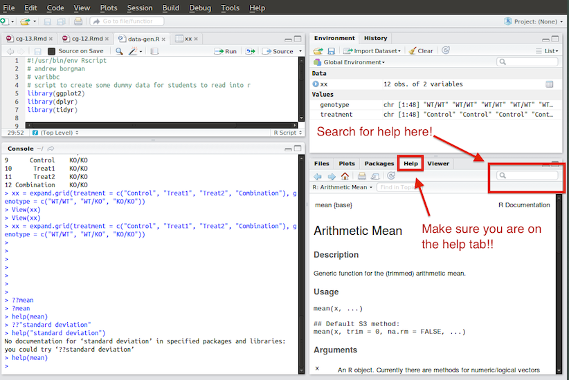
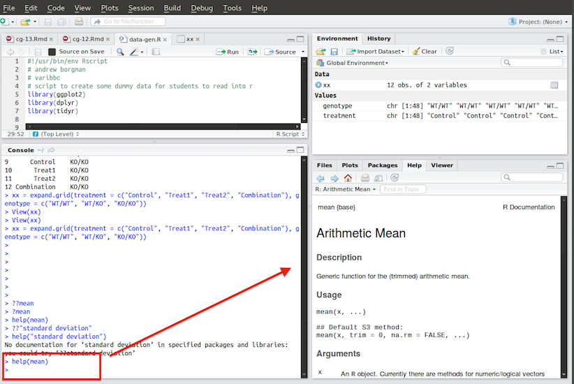
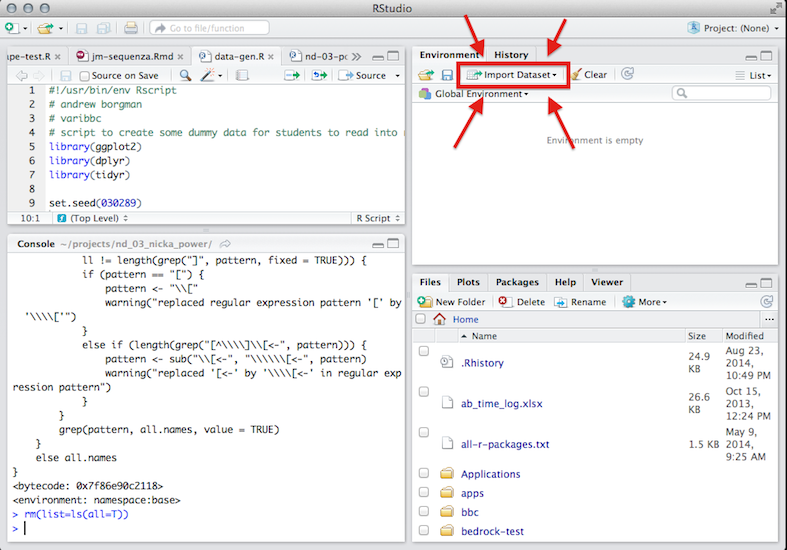

<!-- Cheating in some CSS -->
<style>
.r {
  background-color: #ffffff
}
</style>

<!-- Cheating in some CSS -->


```{r config, echo=FALSE, message=FALSE, eval=TRUE}
library(knitr)
opts_chunk$set(results="hide", message=FALSE, fig.show="hide", fig.align="center", tidy=TRUE)
```


*******


# External Resources

Such a short tutorial cannot cover the vast *R* universe in much detail. Fortunately, one of the greatest things about *R* is the vibrant community supporting it. One can find endless tutorials, books, presentations, etc. on just about any aspect of *R* you want -- from beginner topics to advanced matters. Once you have some familiarity with *R*, you'll be able to *"Google your way out"* of most problems you run into. Here's a small list of useful resources:

* [RStudio provides many online learning resources](http://www.rstudio.com/resources/training/online-learning/)
* [And even more helpful links buried in an RStudio wiki page](https://support.rstudio.com/hc/en-us/articles/200552336-Getting-Help-with-R)
* [Code School has an excellent tutorial to help you get acquainted with R](http://tryr.codeschool.com/) 
* [StackOverflow is a great place to find answers to R programming questions](http://stackoverflow.com/questions/tagged/r)
* [Google Developers intro to R video tutorials](https://www.youtube.com/watch?v=iffR3fWv4xw&list=PLOU2XLYxmsIK9qQfztXeybpHvru-TrqAP)
* [Advanced R by Hadley Wickham](http://adv-r.had.co.nz/)
	- The first few sections are excellent for beginners
	- The rest of the book is essential for a deep understanding of *R*


*******


# Brief Intro To RStudio & *R* Concepts

### The *R* Console

*R* was initially developed to be an *interactive* computing language -- meaning users manually enter commands into an *R* *console* to produce a result. Interactive computing is a great way to investigate data sets and perform [exploratory data analysis](http://en.wikipedia.org/wiki/Exploratory_data_analysis). This is one of the main reasons for *R*'s popularity in the scientific community. 

RStudio has an *R* console running inside it:


[Here's some useful tips](https://support.rstudio.com/hc/en-us/articles/200404846-Working-in-the-Console) on using the *R* console in *RStudio*.

*******

### *R* Calculator

In it's most basic form, the *R* console can be used as a glorified calculator. Enter the following commands into your *R* console to see it in action.

```{r}
2+2
5*4
2^3
```

It is also smart enough to understand order of operations:

```{r}
2+3*4/(5+3)*15/2^2+3*4^2
```
But *R* can be much more than just a calculator... :)

*******


### R Objects

Here, we'll cover some of the basics related to using R objects. Everything that exists in *R* is known as an object. Don't worry too much about what that means for now. Focus on learning how to use *R* objects. 

#### Assignment

Objects in *R* are assigned to **variables**. Variables allow us to name *things* we're using in our *R* computations so they may be easily accessed and manipulated later. 

Here's an example of assigning the number `3` to the variable name `x`:

```{r}
x <- 3
```

`<-` is known as the assignment operator in *R*. The code chunk above would be read "x is assigned the value of three". When you type the name of a variable that has been assigned a value, *R* will typically print the assigned value:

```
> x <- 3
> x
[1] 3
```

If you type the name of an object that does not exist, you will get an error

```
> y
Error: object 'y' not found
```

You can name your variables anything you want, but there are a few rules:

1. Names may contain letters, numbers or periods, and the underscore character
2. Names must start with a letter or period. 
3. `v.one` and `v_one` are valid names but `v one` is not (because it includes a space).

More information on general *R* programming style can be found [here](http://r-pkgs.had.co.nz/style.html).


#### R Data Types

Objects in *R* can be a number of different types. Here we'll discuss the three types you are most likely to encounter. 

1. **Character**: character objects are letters, words, or strings.
	- Ex: `'j'`, `'hello'`, `'treatment A'`
2. **Numeric**: numeric objects are integers or real numbers
	- Ex: `1`, `550`, `3.14`
3. **Logical**: logical objects take the value of `TRUE` and `FALSE` and are often used to control programming flow

*******

### R Data Structures

An excellent comprehensive overview of the types of objects used to store data in *R* can be found [here](http://adv-r.had.co.nz/Data-structures.html). [Quick-R](http://www.statmethods.net/) also provides and excellent [quick reference](http://www.statmethods.net/input/datatypes.html). We'll briefly cover the most common of these below.

#### Vectors

Vectors are *R*'s most basic data structure. When we created the variable `x` in the previous section, we had actually created a *vector* of length 1. The elements contained in a vector must be of the same *type* (see prev. section). Vectors including more than one element are frequently constructed using the `c()` (concatenate) function:

```{r}
a <- c(1,2,5.3,6,-2,4) # numeric vector
b <- c("one","two","three") # character vector
c <- c(TRUE,TRUE,TRUE,FALSE,TRUE,FALSE) # logical vector
```

You can access values inside of a vector by *subsetting* it with the `[]` operators. Examples:

```
> a[1] # access the first element of a
[1] 1
> a[3] # access the fourth element of a
[1] 5.3
> b[length(b)] # acess the last element of b
[1] "three"
```

#### Matricies/Arrays

Matrices and arrays are vectors with *dimensions*. Since they are vectors, they can only contain elements of the same *type*. Matrices have 2 dimensions (rows & columns) and are created with the `matrix` function:

```
> matrix(1:25, ncol = 5, nrow = 5)
     [,1] [,2] [,3] [,4] [,5]
[1,]    1    6   11   16   21
[2,]    2    7   12   17   22
[3,]    3    8   13   18   23
[4,]    4    9   14   19   24
[5,]    5   10   15   20   25
```

Arrays act very similar to matrices, but can have more than 2 dimensions. Here we create a three dimensional array (cube of numbers):

```
> array(1:24, dim = c(2, 4, 3))
, , 1

     [,1] [,2] [,3] [,4]
[1,]    1    3    5    7
[2,]    2    4    6    8

, , 2

     [,1] [,2] [,3] [,4]
[1,]    9   11   13   15
[2,]   10   12   14   16

, , 3

     [,1] [,2] [,3] [,4]
[1,]   17   19   21   23
[2,]   18   20   22   24
```

We can subset arrays in matrices in the same way we did vectors, but we must be conscious of their dimensionality. For a matrix, `m`, we would access the data stored in row 2 and column 5 by typing `m[2, 5[`.

#### Data Frames

Data frames are the *R* data structure you will deal with most frequently as a new useR. *R*'s data import/export functions will return these by default. They can also be created using the `data.frame()` function (see `?data.frame` for more options). Here's a quick example creating some dummy experimental data:

```
> data.frame(group = rep(c('trt', 'ctrl'), each=5), response = rnorm(10))
   group    response
1    trt  0.01231700
2    trt  0.55028627
3    trt -0.24411263
4    trt  0.35996580
5    trt  0.89960231
6   ctrl -0.76686861
7   ctrl  0.03573818
8   ctrl  1.69159332
9   ctrl  0.09612385
10  ctrl  0.60415288
```


#### Lists

Like vectors, lists are containers allowing one to store multiple *R* objects in the same parent object. Unlike vectors, lists do not enforce the rule that all of the elements must be of the same type. For example, we'll create a list with some info about a person:

```{r}
person <- list(first = 'andrew', last = 'borgman', age = 25, interests = c('math', 'computers', 'biology'))
```

*******

### R Built-In Functions

*R* also provides users with many built in functions allowing users to perform a range of tasks -- from computing summary statistics, to fitting linear models, to generating random variables. There are lots of good lists [out](http://www.sr.bham.ac.uk/~ajrs/R/r-function_list.html) [there](http://www.statmethods.net/management/functions.html). 

One of best ways to discover all the built-in helpers *R* has to offer is by reading [lists of](http://www.statmethods.net/management/functions.html) [available functions](http://adv-r.had.co.nz/Vocabulary.html). In most cases, *R* functions have been given logical names. For example, the `mean` function is used to find the average of a vector of numbers:

```
> my_data <- c(10, 22, 44, 55, 14, 66)
> mean(my_data)
[1] 35.16667
```

*R* comes with a great deal of built in documentation. The fastest way to search for built in functions is from *RStudio*'s help search tool. Let's say we want to find a function that computes the standard deviation of a vector of numbers. We would choose the help tab in the *RStudio* viewer pane, and type something like "standard deviation" in the search box.




 In the days before *RStudio*, all of this searching took place on the command line. You may find this is a more convenient way to search for *R* help, so we'll cover it here. The `help()` and `?` functions can be used to search the documentation for functions matching the inputted text. The following functions perform the same task -- searching *R*'s help documentation for any functions named `mean`.

```{r, eval=FALSE, tidy=FALSE}
?mean
help(mean)
```

If we got lucky and picked the right name of the function, *RStudio* will pop up a help window showing the function documentation like this:



But sometimes we don't know the name of the function we seek. Fortunately, *R*'s documentation search is flexible enough to accomodate that. Let's try to find a function that lets us compute the standard deviation of a vector of numbers. First, we'll try a serach with the name of the function used in *Excel* software

```
> ?stdev
No documentation for ‘STDEV’ in specified packages and libraries:
you could try ‘??STDEV’
```

You'll see that *R* gives us a hint and is telling us to use the function `??`. This function works like the search box we used to find help in *RStudio*. Let's search for "standard deviation":

```{r, eval=FALSE, tidy=FALSE}
??"standard deviation"
```

We see the same search results returned in the *RStudio* help pane. 

#### **And, if all else fails, try *Googleing* to see if the function you seek exists!!**

*******

### The R Workspace

#### Defining & Viewing the Workspace

The *R* workspace can be thought of as a container holding all of the objects you've created duing your *R* session. You can print a list of all of the objects in your current workspace using the `ls()` function. If we start a new *R* session, our workspace will be empty:

```
> ls()
character(0)
```

And we'll be able to see some objects if we add them:

```
> x <- 20
> y <- 30
> z <- x + y
> df <- data.frame(nums = 1:10, b = letters[1:10])
> ls()
[1] "df" "x"  "y"  "z" 
```

You can also keep tabs on the objects in your workspace using the *Environment* panel in *RStudio*. 


Clicking on object in the environment panel will allow you to view the data behind it.


*******

#### Saving Your Workspace for Later

Oftentimes, your analysis and work on a data set will span more than one *R* session. *R* provides built in facilities for saving snapshots of your workspace so you can easily pick up where you left off and continue your analysis. This can be very useful for beginner *R* users who still do most of their work interactively. Here's a breakdown of some useful files for 

* `save.image`: Lets you save a snapshot of your entire workspace to a `*.RData` file.
    - Typical usage: `save.image('my-work.RData')`
* `save`: Lets you save a snapshot of a few specified objects to a `*.RData` file.
    - This can be useful if you only want to save one or 2 things (like a modified data set).
    - Typical usage (saving `df` the `data.frame` we created in the last section): `save(df, file = 'my-dataframe.RData')`
* `load`: Lets you load your saved `*.RData` files back in to *R* ot continue working on them. 
    -  Typical usage (saving `df` the `data.frame` we created in the last section): `load('my-dataframe.RData')`

*******

#### Clearing Your Workspace

There are two main ways to clear your workspace in *R*/*RStudio*: 1) using the `rm()` function to remove objects and 2) using the *Clear* button in *RStudio*. 
The `rm()` command allows you to selectively remove objects from your *R* session when they are no longer needed (see `?rm` for more details). Here's an example of the usage:

```
> ls() # start in an empty workspace
character(0)
> y <- 1
> z <- 1
> ls() # can see the two objects we created
[1] "y" "z"
> rm(y) # remove y
> ls()  
[1] "z"
```

You can remove *all* objects in your workspace by using `ls()` to generate a vector of all the objects that have been created, and passing that to the `rm()` function:

```{r, eval = F}
rm(list = ls())
```

You can also use a button in *RStudio*'s *Environment* panel to remove all of the objects in your workspace. *RStudio* will prompt you asking if you are sure you want to go through with deleting all objects, choosing *Yes* will permanently delete all objects in the workspace.


*******

### R Packages

Packages are what make *R* so great. Packages allow *R* users to develop and **share** new code to extend the language -- e.g. implementing a new statistical model for analyzing microarrays, creating an awesome new graph to show copy number alterations in tumor samples, etc. *R* has become the *lingua franca* for statisticians developing new statistical techniques and has been widely adopted in the bioinformatics community ([Bioconductor](http://bioconductor.org/)).

#### CRAN

Most generic *R* packages are hosted on the Comprehensive *R* Archive Network [CRAN](http://cran.us.r-project.org/). To install one of these packages, you would use `install.packages("packagename")`. You only need to install a package once, then load it each time using `library(packagename)`. Here's how one would install and load the `ggplot2` package.

```{r, eval=FALSE}
# Install only once.
install.packages("ggplot2")

# Load the package every time you want to use it.
library(ggplot2)
```


*******


# Getting Data Into R


### Example Data

Now that we're feeling a bit more comfortable with the *R* environment, we'll explore how we can import our own experimental data into *R*. 

**Before going any further, please download the zip file below and extract its contents somewhere on your computer.**

* <a href="https://github.com/borgmaan/r-intro/blob/master/data/data_dl.zip?raw=true" target="_blank">data_dl.zip</a>

*******


### Data Storage File types

The easiest way to store data for import into *R* is in text files. R has facilities for importing data directly from Excel spreadsheets or from some data base format, but such performing such operations is outside the scope of this course. 

Flat text files containing data typically have some type of special character ([delimiter](http://en.wikipedia.org/wiki/Delimiter-separated_values)) -- think: tab, semicolon, space -- for separating different columns of data. Data stored in text files most commonly falls into the following formats.


#### Tab-Delimited Files

Tab-delimited files are easily [exported from Excel](http://office.microsoft.com/en-us/excel-help/import-or-export-text-txt-or-csv-files-HP010099725.aspx) and are one of the best ways to store data in a flat text file. Tab-delimited files typically have a file extension of `.txt` or `.tsv`.

```
ID  Group   Gene1   Gene2   Gene3   Gene4
Sample 1    Group 1 9.695   4.694   3.733   4.874
Sample 2    Group 1 8.087   3.276   2.220   3.095
Sample 3    Group 1 9.885   6.297   5.842   8.233
Sample 4    Group 1 7.832   -1.286  2.594   -1.089
Sample 5    Group 1 10.239  4.474   3.300   3.377
```

#### Exporting TSV from Excel

`File -> Save As -> Tab-Delimited Text`


#### Comma-Delimited Files

It is also very easy to export comma-delimited files [from Excel](http://office.microsoft.com/en-us/excel-help/import-or-export-text-txt-or-csv-files-HP010099725.aspx). Comma-delimited files typically have a file extension of `.csv`.

```
"ID","Group","Gene1","Gene2","Gene3","Gene4"
"Sample 1","Group 1",9.695,4.694,3.733,4.874
"Sample 2","Group 1",8.087,3.276,2.220,3.095
"Sample 3","Group 1",9.885,6.297,5.842,8.233
"Sample 4","Group 1",7.832,-1.286,2.594,-1.089
"Sample 5","Group 1",10.239,4.474,3.300,3.377
```

#### Exporting CSV from Excel

`File -> Save As -> Comma Separated Values`


*******


### R Options for Reading Data

A comprehensive guide on *R* methods of data import and export can be found [here](http://cran.r-project.org/doc/manuals/r-release/R-data.html). We'll cover a few of the most useful functions used for importing and exporting data types you will most likely come across. 

#### Using RStudio Interface

*RStudio* gives users the ability to import data with an *Excel*-style interface. This can be done by clicking the *"Import Dataset"* button in RStudio's *Environment* panel. Clicking this button will pop up a file browser -- navigate to the folder you downloaded and select the file `gene-exprs-long.tsv`.



The import screen allows you to specify a number of options detailing specifics about the data file being imported and the object that will be imported into the *R* environment. 

* **Name:** allows users to specify the name of the object being imported into the *R* environment
*  **Heading:** does the data you are importing have headers specifying the names for you columns?
*  **Separator:** allows you to specify the *delimiter* separating columns in the data being imported (e.g. "Tab" for `.tsv`, "Comma" for `.csv`, etc.)
* **Decimal:** what character represents the decimal in you data (comma for European data :))
* **Quote:** what character indicates the *quote* character in your text file. Quotes are typically used to indicate a full string between delimiters 
* **na.strings:** what set of characters in your data indicates missing data (`""`, `NA`, `999`)
* **Strings as factors:** do you want your strings [imported as factors](http://stackoverflow.com/questions/8652694/r-use-of-factor)?


You can check to see that your chosen options are importing your `data.frame` correctly by viewing the output in the *"Data Frame"* section of the *"Import Dataset"* window:


After clicking import, we can see that *RStudio* has generated the necessary *R* code in the console to import the data file and that our `data.frame` object has been added to the workspace:


#### read.table/read.delim

In the previous section, we saw *RStudio* generate a `read.delim` function to import our `.tsv` data frame. `read.delim` is a special alternative to *R*'s more general `read.table` function (`?read.table` for details). `read.table` is *R*'s workhorse function for data I/O. As you become more comfortable with *R*, it will become your *de facto* method for importing data. For now, it would be instructive to observe

#### read.csv

`read.csv` is another special alternative to `read.table`. They are based on the same underlying function, but `read.csv` has default arguments for reading `.csv` files. For more info, type `?read.csv` into the *R* console. 


*******


# Basic Data Manipulation

People [often are surprised](http://www.nytimes.com/2014/08/18/technology/for-big-data-scientists-hurdle-to-insights-is-janitor-work.html?_r=0) at the amount of time analysts spend manipulating/cleaning/munging [data analysis]

### Subsetting

Oftentimes, analysts will want to work with only a subset of their data at one time. A definitive guide on subsetting in *R* can be found [here](http://adv-r.had.co.nz/Subsetting.html). There are many ways to subset data in *R*, but we'll cover the most useful here.

### Wide vs. Long Format

Data analysts have come up with ways to describe the format of the data they work in. Most of the data you come into contact with will be in either [wide or long](http://en.wikipedia.org/wiki/Wide_and_narrow_data) format. 


# Basic Plotting

### R Graphing Systems

There are three main graphing frameworks available in *R* for creating high quality plots:

#### 1) Base Graphics

The *base* graphics system is the original plotting framework for the *R* language. One can produce anything from very simple to infinitely complex graphics using the *base* system; however, creating simple plots with annotation elements (e.g. coloring, legends, etc) can be cumbersome for new *R* users. A good demo of some of the key features of the base graphics system [can be found here](http://rpubs.com/SusanEJohnston/7953). We will not be covering *base* graphics in this tutorial.

#### 2) Lattice Graphics

The [lattice package](http://cran.r-project.org/web/packages/lattice/index.html) was developed as an attempt to improve on base *R* graphics by providing better defaults and the ability to easily display multivariate relationships. Lattice graphics 

#### 3) ggplot2 Graphics

`ggplot2` is a plotting system for *R*, based on the [grammar of graphics](http://www.amazon.com/The-Grammar-Graphics-Statistics-Computing/dp/0387245448), which tries to take the good parts of *base* and *lattice* graphics and none of the bad parts. It takes care of many of the fiddly details that make plotting a hassle (like drawing legends) as well as providing a powerful model of graphics that makes it easy to produce complex multi-layered graphics (taken from [ggplot2 site](http://ggplot2.org/)). `ggplot2` allows intro *R* users to create high quality data visualizations with little effort using an intuitive plotting syntax. 

An excellent presentation with info & examples for all three systems can be found [here](http://faculty.ucr.edu/~tgirke/HTML_Presentations/Manuals/Rgraphics/Rgraphics.pdf). I would strongly suggest learning and using `ggplot2` for all of your *R* plotting needs. I'll link to some useful tutorials in the next section.

### ggplot2 for Beginners

* [Nice walkthrough of using `qplot` to make complex graphics](https://github.com/echen/ggplot2-tutorial)
* [Excellent quick overview of ggplot2](http://www.ceb-institute.org/bbs/wp-content/uploads/2011/09/handout_ggplot2.pdf)
* [In depth guide of ggplot2](http://www.ling.upenn.edu/~joseff/avml2012/)
* [Quick reference for ggplot2](http://sape.inf.usi.ch/quick-reference/ggplot2)


# Thanks!

#### Thanks so much for attending!!


