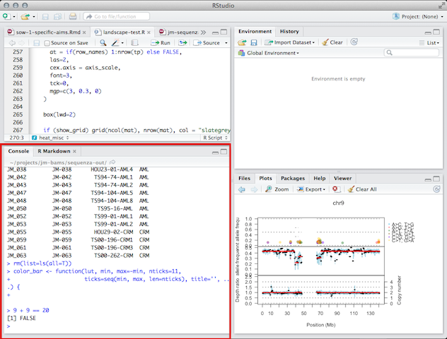

```{r config, echo=FALSE, message=FALSE, eval=TRUE}
library(knitr)
opts_chunk$set(results="hide", message=FALSE, fig.show="hide", fig.align="center", tidy=TRUE)
```

-----


# Disclaimer 

## *Document is still a work in progress*


-----


# External Resources

Such a short tutorial cannot cover the vast *R* universe in much detail. Fortunately, one of the greatest things about *R* is the vibrant community supporting it. One can find endless tutorials, books, presentations, etc. on just about any aspect of *R* you want -- from beginner topics to advances matters. Once you have some familiarity with *R*, you'll be able to "Google your way out" of most problems you run into. Here's a small list of useful resources:

* [RStudio provides many online learning resources](http://www.rstudio.com/resources/training/online-learning/)
* [And even more helpful links buried in an RStudio wiki page](https://support.rstudio.com/hc/en-us/articles/200552336-Getting-Help-with-R)
* [Code School has an excellent tutorial to help you get acquainted with R](http://tryr.codeschool.com/) 
* [StackOverflow is a great place to find answers to R programming questions](http://stackoverflow.com/questions/tagged/r)
* [Google Developers intro to R video tutorials](https://www.youtube.com/watch?v=iffR3fWv4xw&list=PLOU2XLYxmsIK9qQfztXeybpHvru-TrqAP)
* [Advanced R by Hadley Wickham](http://adv-r.had.co.nz/)
	- The first few sections are excellent for beginners
	- The rest of the book is essential for a deep understanding of *R*


-----


# Brief Intro To RStudio & *R* Concepts

### The *R* Console

*R* was initially developed to be an *interactive* computing language -- meaning users manually enter commands into an *R* *console* to produce a result. Interactive computing is a great way to investigate data sets and perform [exploratory data analysis](http://en.wikipedia.org/wiki/Exploratory_data_analysis). This is one of the main reasons for *R*'s popularity in the scientific community. 

RStudio has an *R* console running inside it:




### *R* Calculator

In it's most basic form, the *R* console can be used as a glorified calculator. Enter the following commands into your *R* console to see it in action.

```{r}
2+2
5*4
2^3
```

It is also smart enough to understand order of operations:

```{r}
2+3*4/(5+3)*15/2^2+3*4^2
```
But *R* can be much more than just a calculator... :)


### R Objects

Here, we'll cover some of the basics related to using R objects. Everything that exists in *R* is known as an object. Don't worry too much about what that means for now. Focus on learning how to use *R* objects. 

#### Assignment

Objects in *R* are assigned to **variables**. Variables allow us to name *things* we're using in our *R* computations so they may be easily accessed and manipulated later. 

Here's an example of assigning the number `3` to the variable name `x`:

```{r}
x <- 3
```

`<-` is known as the assignment operator in *R*. The code chunk above would be read "x is assigned the value of three". When you type the name of a variable that has been assigned a value, *R* will typically print the assigned value:

```
> x <- 3
> x
[1] 3
```

If you type the name of an object that does not exist, you will get an error

```
> y
Error: object 'y' not found
```

You can name your variables anything you want, but there are a few rules:

1. Names may contain letters, numbers or periods, and the underscore character
2. Names must start with a letter or period. 
3. `v.one` and `v_one` are valid names but `v one` is not (because it includes a space).

More information on general *R* programming style can be found [here](http://r-pkgs.had.co.nz/style.html).

#### R Data Types

Objects in *R* can be a number of different types. Here we'll discuss the three types you are most likely to encounter. 

1. **Character**: character objects are letters, words, or strings.
	- Ex: `'j'`, `'hello'`, `'treatment A'`
2. **Numeric**: numeric objects are integers or real numbers
	- Ex: `1`, `550`, `3.14`
3. **Logical**: logical objects take the value of `TRUE` and `FALSE` and are often used to control programming flow


#### R Data Structures

An excellent comprehensive overview of the types of objects used to store data in *R* can be found [here](http://adv-r.had.co.nz/Data-structures.html). We'll briefly cover the most common of these below.

**Vectors**

Vectors are *R*'s most basic data structure. When we created the variable `x` in the previous section, we had actually created a *vector* of length 1. The elements contained in a vector must be of the same *type* (see prev. section). Vectors including more than one element are frequently 

**Lists**

**Matricies/Arrays**

**Data Frames**


#### R Built-In Functions

*R* also provides users with many built in functions allowing users to perform a range of tasks -- from computing summary statistics, to fitting linear models, to generating random variables. There are lots of good lists [out](http://www.sr.bham.ac.uk/~ajrs/R/r-function_list.html) [there](http://www.statmethods.net/management/functions.html). 

The best way to discover these if by [reading lists of available functions](http://adv-r.had.co.nz/Vocabulary.html) or *Google-ing* to see if the function you seek exists. In most cases, *R* functions have been given logical names. For example, the `mean` function is used to find the average of a vector of numbers:

```
> my_data <- c(10, 22, 44, 55, 14, 66)
> mean(my_data)
[1] 35.16667
```


### The R Workspace

The *R* workspace can be thought of as a container holding all of the objects you've created duing your *R* session. You can print a list of all of the objects in your current workspace using the `ls()` function. If we start a new *R* session, our workspace will be empty:

```
> ls()
character(0)
```

And we'll be able to see some objects if we add them:

```
> x <- 20
> y <- 30
> z <- x + y
> ls()
[1] "x" "y" "z"
```


**TODO: show how you can view the environment in RStudio**


### R Packages

Packages are what make *R* so great. Packages allow *R* users to develop and **share** new code to extend the language -- e.g. implementing a new statistical model for analyzing microarrays, creating an awesome new graph to show copy number alterations in tumor samples, etc. *R* has become the *lingua franca* for statisticians developing new statistical techniques and has been widely adopted in the bioinformatics community ([Bioconductor](http://bioconductor.org/)).

#### CRAN

Most generic *R* packages are hosted on the Comprehensive *R* Archive Network [CRAN](http://cran.us.r-project.org/). To install one of these packages, you would use `install.packages("packagename")`. You only need to install a package once, then load it each time using `library(packagename)`. Here's how one would install and load the `ggplot2` package.

```{r, eval=FALSE}
# Install only once.
install.packages("ggplot2")

# Load the package every time you want to use it.
library(ggplot2)
```

---


# Getting Data Into R

Now that we're feeling a bit more comfortable with the *R* environment, we'll explore how we can import our own experimental data into *R*. 

Below the first few rows of some data in stored [tidy](http://vita.had.co.nz/papers/tidy-data.pdf) format (more on this later). 

| id|treatment |      vals|
|--:|:---------|---------:|
|  1|Control   |  7.739886|
|  2|Control   | 11.145914|
|  3|Control   | 10.113178|
|  4|Control   |  9.249644|
|  5|Control   |  9.749033|
|  6|Control   | 11.048534|

### Data Storage File types

The easiest way to store data for import into *R* is in text files. R has facilities for importing data directly from Excel spreadsheets or from some data base format, but such performing such operations is outside the scope of this course. 

Flat text files containing data typically have some type of special character ([delimiter](http://en.wikipedia.org/wiki/Delimiter-separated_values)) -- think: tab, semicolon, space -- for separating different columns of data. Data stored in text files most commonly falls into the following formats.


#### Tab-Delimited Files

Tab-delimited files are easily [exported from Excel](http://office.microsoft.com/en-us/excel-help/import-or-export-text-txt-or-csv-files-HP010099725.aspx) and are one of the best ways to store data in a flat text file. Tab-delimited files typically have a file extension of `.txt` or `.tsv`.

```
id	treatment	vals
1	Control	7.73988631317717
2	Control	11.1459141243514
3	Control	10.1131777328925
4	Control	9.24964428771185
5	Control	9.7490331495698
6	Control	11.048533802881
7	Control	10.8371802055362
```

#### Comma-Delimited Files

It is also very easy to export comma-delimited files [from Excel](http://office.microsoft.com/en-us/excel-help/import-or-export-text-txt-or-csv-files-HP010099725.aspx). Comma-delimited files typically have a file extension of `.csv`.

```
"id","treatment","vals"
1,"Control",7.73988631317717
2,"Control",11.1459141243514
3,"Control",10.1131777328925
4,"Control",9.24964428771185
5,"Control",9.7490331495698
6,"Control",11.048533802881
7,"Control",10.8371802055362
```

### R Functions for Reading Data


# Basic Data Manipulation

People often are surprised at the amount of time Data manipulation/munging  [data analysis](http://www.nytimes.com/2014/08/18/technology/for-big-data-scientists-hurdle-to-insights-is-janitor-work.html?_r=0)

### Subsetting

### Wide vs. Long Format

Data analysts have come up with ways to describe the format of the data they work in. Most of the data you come into contact with will be in either [wide or long](http://en.wikipedia.org/wiki/Wide_and_narrow_data) 


# Basic Plotting


