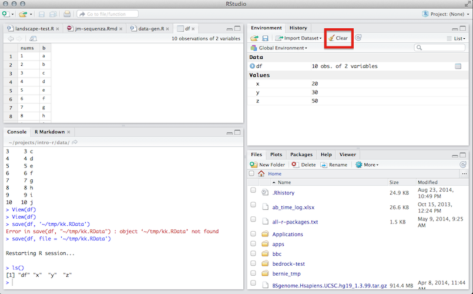
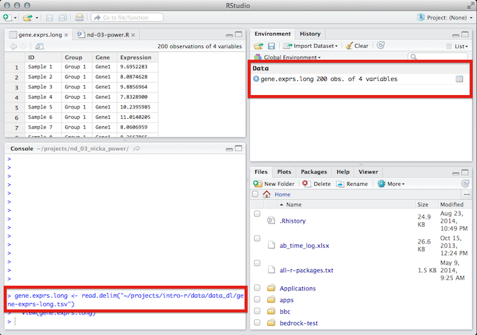
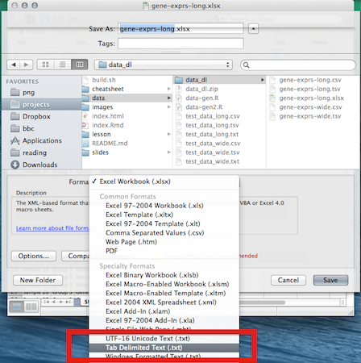
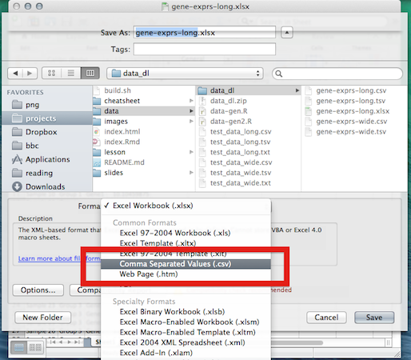

<!-- excel-output.png
excel-csv.png -->


```{r config, echo=FALSE, message=FALSE, eval=TRUE}
library(knitr)
opts_chunk$set(results="hide", message=FALSE, fig.show="hide", fig.align="center", tidy=TRUE, eval = F)
```

## Outline

* What is *R*?
* Brief Intro To *RStudio* & *R* Concepts
* *R* Objects
* The *R* Workspace
* *R* Packages
* Getting Data Into *R*
* Basic Plotting


# What is *R*?

## What is *R*?

* A fully functional programming language!
* Originally developed @ Bell Labs for interactive data analysis
    - Was called *S* back then (~1976)
* Open sourced in 1993 under the name *R*
    - Designed to be "not unlike *S*"
* Strong emphasis on statistics
* Excellent for data visualization
* Gaining popularity in many circles 

# Disclaimer

## Limitations

* This short tutorial can't cover the vast *R* universe 
    - (or even come close :))
* But... *R* has vibrant community supporting it! 
* You can find endless tutorials, books, presentations, etc. on just about any aspect of *R* you want -- from beginner topics to advanced matters. 
* Goal for today:

<div class="red2" class="centered">
Give you enough *R* familiarity, so you'll be able to *"Google your way out"* of most problems you run into
</div>


## External Resources

* [RStudio provides many online learning resources](http://www.rstudio.com/resources/training/online-learning/)
* [And even more helpful links buried in an RStudio wiki page](https://support.rstudio.com/hc/en-us/articles/200552336-Getting-Help-with-R)
* [Code School has an excellent tutorial to help you get acquainted with R](http://tryr.codeschool.com/) 
* [StackOverflow is a great place to find answers to R programming questions](http://stackoverflow.com/questions/tagged/r)
* [Google Developers intro to R video tutorials](https://www.youtube.com/watch?v=iffR3fWv4xw&list=PLOU2XLYxmsIK9qQfztXeybpHvru-TrqAP)
* [Advanced R by Hadley Wickham](http://adv-r.had.co.nz/)
    - The first few sections are excellent for beginners
    - The rest of the book is essential for a deep understanding of *R*


# Brief Intro To *RStudio* & *R* Concepts


## The *R* Console | [Here's some useful tips](https://support.rstudio.com/hc/en-us/articles/200404846-Working-in-the-Console) on using the *R* console in *RStudio*.


## *R* Calculator

* The *R* console can be used as a calculator
* Enter the following commands into your *R* console to see it in action:

```{r}
2+2
5*4
2^3
```

* It is also smart enough to understand order of operations:

```{r}
2+3*4/(5+3)*15/2^2+3*4^2
```

<div class="red2">
But *R* can be much more than just a calculator... :)
</div>


# R Objects

## Assignment {.build}

* Objects in *R* are assigned to **variables**
    - "`<-`" is known as the assignment operator in *R*
* Variables allow us to name *things* we're using in our *R* computations 
    - Let's them be easily accessed and manipulated later
* Here's an example of assigning the number `3` to the variable name `x`:

```{r}
x <- 3
```

* When you type the name of a variable that has been assigned a value, *R* will print the assigned value

```
> x <- 3
> x
[1] 3
```


## Assignment

<div class="red2">
You will get an error if you type the name of an variable that does not have an assigned object: <br/>
</div>

```
> y
Error: object 'y' not found
```

## Variable Names

You can name your variables anything you want, but there are a few rules:

1. Names may contain letters, numbers or periods, and the underscore character
2. Names must start with a letter or period. 
3. `v.one` and `v_one` are valid names but `v one` is not (because it includes a space).

More information on general *R* programming style can be found [here](http://r-pkgs.had.co.nz/style.html).

# R Data Structures

## R Data Types {.bigger}

Objects in *R* can be a number of different types. Next, we'll discuss the three types you are most likely to encounter. 

1. **Character**: character objects are letters, words, or strings.
    - Ex: `'j'`, `'hello'`, `'treatment A'`
2. **Numeric**: numeric objects are integers or real numbers
    - Ex: `1`, `550`, `3.14`
3. **Logical**: logical objects take the value of `TRUE` and `FALSE` and are often used to control programming flow


## R Data Structures

1. Vectors
2. Matricies/Arrays
3. Data Frames
4. Lists

<div class="red2">
See [course handout](http://borgmaan.github.io/r-intro/lesson/intro-r.html) for more details!!
</div>


## Data Frames

* Data frames are the *R* data structure you will deal with most frequently
* *R*'s data import/export functions will return these by default 
* They can also be created using the `data.frame()` function
* Here's a quick example creating some dummy experimental data:

```
> data.frame(group = rep(c('trt', 'ctrl'), each=4), 
            response = rnorm(8))
   group    response
1    trt  0.01231700
2    trt  0.55028627
3    trt -0.24411263
4    trt  0.35996580
5    trt  0.89960231
6   ctrl -0.76686861
7   ctrl  0.03573818
8   ctrl  1.69159332
```

# Functions


## R Built-In Functions

* *R* provides users with many built in functions 
    - These allow users to perform a range of tasks
    - Computing summary statistics, to fitting linear models, to generating random variables. 
* There are lots of good lists of functions [out](http://www.sr.bham.ac.uk/~ajrs/R/r-function_list.html) [there](http://www.statmethods.net/management/functions.html)
* In most cases, *R* functions have been given logical names. 
* Ex: the `mean` function is used to find the average of a vector of numbers:

```
> my_data <- c(10, 22, 44, 55, 14, 66)
> mean(my_data)
[1] 35.16667
```

## R Function Documentation


## R General Searching

### **And, if all else fails, try *Googling* to see if the function you seek exists!!**


# The R Workspace

## Defining & Viewing the Workspace

The *R* workspace can be thought of as a container holding all of the objects you've created duing your *R* session. You can print a list of all of the objects in your current workspace using the `ls()` function. If we start a new *R* session, our workspace will be empty:

```
> ls()
character(0)
```

And we'll be able to see some objects if we add them:

```
> x <- 20
> y <- 30
> z <- x + y
> df <- data.frame(nums = 1:10, b = letters[1:10])
> ls()
[1] "df" "x"  "y"  "z" 
```

## Viewing Your Workspace in *RStudio*


## Viewing Your Data in *RStudio*


## Saving Your Workspace for Later

* `save.image`: saves a snapshot of entire workspace to a file
    - Typical usage: `save.image('my-work.RData')`
* `save`: saves a snapshot of a few specified objects to a file.
    - Useful if you only want to save one or 2 things (like a modified data set).
    - To save, `df`, the `data.frame` we created in the last section: 
    - `save(df, file = 'my-dataframe.RData')`
* `load`: loads your saved `*.RData` files back in to *R*
    -  To load, `df`, the `data.frame` we just saved: 
    - `load('my-dataframe.RData')`

## Clearing Your Workspace

* There are two main ways to clear your workspace in *R*/*RStudio* 
    1. using the `rm()` function to remove objects and 
    2. using the *Clear* button in *RStudio*. 
* `rm()` lets you remove objects from your *R* session when they aren't needed
* Example of the usage:

```
> ls() # start in an empty workspace
character(0)
> y <- 1
> z <- 1
> ls() # can see the two objects we created
[1] "y" "z"
> rm(y) # remove y
> ls()  
[1] "z"
```

You can remove *all* objects in your workspace by using `ls()` to generate a vector of all the objects that have been created, and passing that to the `rm()` function:

```{r, eval = F}
rm(list = ls())
```

You can also use a button in *RStudio*'s *Environment* panel to remove all of the objects in your workspace. *RStudio* will prompt you asking if you are sure you want to go through with deleting all objects, choosing *Yes* will permanently delete all objects in the workspace.




# R Packages

## R Packages

* Packages are what make *R* so great. 
* Packages allow *R* users to develop and **share** new code to extend the language
    - e.g. implementing a new statistical model for analyzing microarrays, creating an awesome new graph to show copy number alterations in tumor samples, etc.
* *R* has become the *lingua franca* for statisticians developing new statistical techniques
* Has also been widely adopted in the bioinformatics community ([Bioconductor](http://bioconductor.org/))

## CRAN

Most generic *R* packages are hosted on the Comprehensive *R* Archive Network [CRAN](http://cran.us.r-project.org/). To install one of these packages, you would use `install.packages("packagename")`. You only need to install a package once, then load it each time using `library(packagename)`. Here's how one would install and load the `ggplot2` package.

```{r, eval=FALSE}
# Install only once.
install.packages("ggplot2")

# Load the package every time you want to use it.
library(ggplot2)
```

---


# Getting Data Into R


## Example Data

Now that we're feeling a bit more comfortable with the *R* environment, we'll explore how we can import our own experimental data into *R*. 

**Before going any further, please download the zip file below and extract its contents somewhere on your computer.**

* <a href="https://github.com/borgmaan/r-intro/blob/master/data/data_dl.zip?raw=true" target="_blank">data_dl.zip</a>


## Data Storage File types

* Easiest way to store data for import into *R* is in flat text files. 
* Can import from other data stores (Excel sheet, database, etc)
    - But that is out of the scope of this tutorial
* Flat text files containing data typically have a column separator ([delimiter](http://en.wikipedia.org/wiki/Delimiter-separated_values)) 
    - think: tab, semicolon, space 
* Two easy ones to export from Excel are (see handout for examples):
    - Tab-Delimited Files
    - Comma-Delimited Files


<!-- Removed file descriptors -->

# Let's actually do something!


## Importing Data with RStudio


## Using RStudio Import Interface


## Using RStudio Import Interface


## Using RStudio Import Interface




## read.table/read.delim/read.csv

* Just saw *RStudio* generate a `read.delim` function to import our `.tsv` data frame
* `read.delim` is a special alternative to *R*'s more general `read.table` function (`?read.table` for details)
* `read.csv` is another special alternative to `read.table`
* `read.csv` & `read.delim` have 


# Basic Data Manipulation

## Subsetting

* Oftentimes, analysts will want to work with only a subset of their data at one time
* A definitive guide on subsetting in *R* can be found [here](http://adv-r.had.co.nz/Subsetting.html)
* There are many ways to subset data in *R*, but we'll touch on a couple important ones

## Subsetting with Numeric Indicies

```
> gene.exprs.long[1:5, ] # print the first 5 rows
        ID   Group  Gene Expression
1 Sample 1 Group 1 Gene1   9.695228
2 Sample 2 Group 1 Gene1   8.087463
3 Sample 3 Group 1 Gene1   9.885696
4 Sample 4 Group 1 Gene1   7.832890
5 Sample 5 Group 1 Gene1  10.239599
```

```
> gene.exprs.long[1:5, 1:2] # print the first 5 rows and columns 1 & 2
        ID   Group
1 Sample 1 Group 1
2 Sample 2 Group 1
3 Sample 3 Group 1
4 Sample 4 Group 1
5 Sample 5 Group 1
```


## *subset* Function

* Usage: `subset(dataset, logical conditions)`

```
> subset(gene.exprs.long, ID == 'Sample 1') # All Sample 1 measures
          ID   Group  Gene Expression
1   Sample 1 Group 1 Gene1   9.695228
51  Sample 1 Group 1 Gene2   4.694323
101 Sample 1 Group 1 Gene3   3.733354
151 Sample 1 Group 1 Gene4   4.874305
```

```
> subset(gene.exprs.long, Expression > 10) # gene expression > 10
          ID   Group  Gene Expression
5   Sample 5 Group 1 Gene1   10.23960
6   Sample 6 Group 1 Gene1   11.01402
10 Sample 10 Group 1 Gene1   10.10460
13 Sample 13 Group 2 Gene1   10.21796
16 Sample 16 Group 2 Gene1   10.03342
46 Sample 46 Group 5 Gene1   10.11114
```

## *subset* Function

* This can be useful for stats when you are just starting out:

```
> gene1 <- subset(gene.exprs.long, Gene == 'Gene1') # only data for gene 1
> summary(aov(Expression ~ Group, data = gene1)) # run an ANOVA on it
            Df Sum Sq Mean Sq F value  Pr(>F)   
Group        4  13.08   3.271   4.879 0.00236 **
Residuals   45  30.17   0.670                   
---
Signif. codes:  0 ‘***’ 0.001 ‘**’ 0.01 ‘*’ 0.05 ‘.’ 0.1 ‘ ’ 1
```

<div class="red2">
Look! *R* prints stars!! ;)
</div>

## Wide vs. Long Format

* Data analysts have come up with ways to describe the format of the data they work in 
* Most of the data you come into contact with will be in either [wide or long](http://en.wikipedia.org/wiki/Wide_and_narrow_data) format
* See data files in example zip folder for wide and long versions of same data set
* The [reshape2 package](http://cran.r-project.org/web/packages/reshape2/index.html) is good for going from wide to long and back 
    - here's a [good tutorial](http://seananderson.ca/2013/10/19/reshape.html)
* Keeping your data in *long* format will make your life in *R* easier!


# Basic Plotting

## R Graphing Systems

There are three main graphing frameworks available in *R* for creating high quality plots:

1. Base Graphics
2. Lattice Graphics
3. ggplot2 Graphics

<div class='red2'>
**I would suggest learning `ggplot2`!**
</div>

## ggplot2 Graphics

`ggplot2` allows intro *R* users to create high quality data visualizations with little effort using an intuitive plotting syntax:

<blockquote>
    `ggplot2` is a plotting system for *R*, based on the [grammar of graphics](http://www.amazon.com/The-Grammar-Graphics-Statistics-Computing/dp/0387245448), which tries to take the good parts of *base* and *lattice* graphics and none of the bad parts. It takes care of many of the fiddly details that make plotting a hassle (like drawing legends) as well as providing a powerful model of graphics that makes it easy to produce complex multi-layered graphics (taken from [ggplot2 site](http://ggplot2.org/)). 
</blockquote>


## ggplot2 for Beginners

* [Nice walkthrough of using `qplot` to make complex graphics](https://github.com/echen/ggplot2-tutorial)
* [Excellent quick overview of ggplot2](http://www.ceb-institute.org/bbs/wp-content/uploads/2011/09/handout_ggplot2.pdf)
* [In depth guide of ggplot2](http://www.ling.upenn.edu/~joseff/avml2012/)
* [Quick reference for ggplot2](http://sape.inf.usi.ch/quick-reference/ggplot2)

## qplot() Usage

* `qplot()` is the easiest way to get started with `ggplot2`
* If you haven't done so already, please run the following commands:

```{r, eval=FALSE}
# Install only once.
install.packages("ggplot2")

# Load the package every time you want to use it.
library(ggplot2)
```

## qplot() Usage

```{r, include = F, eval = T}
library(ggplot2)
gene.exprs.long <- read.delim("../data/data_dl/gene-exprs-long.tsv")
```

* Let's plot our gene expression data set!
* First, a basic `qplot` call:

```
qplot(x = Gene, y = Expression, data = gene.exprs.long)
```

```{r, eval = T, results='markup', fig.show='asis', fig.height = 4, fig.width = 4.5, echo = F}
qplot(x = Gene, y = Expression, data = gene.exprs.long)
```

## Change the Plot Type!

* `qplot` guesses what the best graphical display would be given your data
* You can override this to get other graphics
    - Done by specifying the `geom` option

```
qplot(x = Gene, y = Expression, data = gene.exprs.long, geom = 'boxplot')
```

```{r, eval = T, results='markup', fig.show='asis', fig.height = 4, fig.width = 4.5, echo = F}
qplot(x = Gene, y = Expression, data = gene.exprs.long, geom = 'boxplot')
```

## Add Some Color

* The `color` option adds color!

```
qplot(x = Gene, y = Expression, data = gene.exprs.long, color = Gene)
```

```{r, eval = T, results='markup', fig.show='asis', fig.height = 4, fig.width = 4.5, echo = F}
qplot(x = Gene, y = Expression, data = gene.exprs.long, color = Gene)
```

## Add Some Color

* Or `fill` for some `geom`s

```
qplot(x = Gene, y = Expression, data = gene.exprs.long, geom = 'boxplot', 
      fill = Gene)
```

```{r, eval = T, results='markup', fig.show='asis', fig.height = 4, fig.width = 4.5, echo = F}
qplot(x = Gene, y = Expression, data = gene.exprs.long, geom = 'boxplot', 
      fill = Gene)
```

## Or Make Some Facets

```
qplot(x = Group, y = Expression, data = gene.exprs.long, fill = Group, 
      facets = ~ Gene, geom = 'boxplot')
```

```{r, eval = T, results='markup', fig.show='asis', fig.height = 4, fig.width = 4.5, echo = F}
qplot(x = Group, y = Expression, data = gene.exprs.long, fill = Group, 
      facets = ~ Gene, geom = 'boxplot')
```

## Or Make Some Facets & Make It Pretty

```
qplot(x = Group, y = Expression, data = gene.exprs.long, color = Group, 
    facets = ~Gene, geom = "jitter") + theme_bw() + 
    scale_color_brewer(type = 'qual', palette = "Dark2") + 
    theme(axis.text.x = element_text(angle = 45, hjust = 1))
```

```{r, eval = T, results='markup', fig.show='asis', fig.height = 4, fig.width = 4.5, echo = F}
qplot(x = Group, y = Expression, data = gene.exprs.long, color = Group, 
    facets = ~Gene, geom = "jitter") + theme_bw() + 
    scale_color_brewer(type = 'qual', palette = "Dark2") + 
    theme(axis.text.x = element_text(angle = 45, hjust = 1))
```


# Thanks!

# Thanks!


## Tab-Delimited Files

* Tab-delimited files are easily exported from Excel
* One of the best ways to store data in a flat text file 
* Typically have a file extension of `.txt` or `.tsv`.

```
ID  Group   Gene1   Gene2   Gene3   Gene4
Sample 1    Group 1 9.695   4.694   3.733   4.874
Sample 2    Group 1 8.087   3.276   2.220   3.095
Sample 3    Group 1 9.885   6.297   5.842   8.233
Sample 4    Group 1 7.832   -1.286  2.594   -1.089
Sample 5    Group 1 10.239  4.474   3.300   3.377
```

## Tab-Delimited Files



`File -> Save As -> Tab-Delimited Text`


## Comma-Delimited Files

* It is also very easy to export comma-delimited files from Excel
* Comma-delimited files typically have a file extension of `.csv`.

```
"ID","Group","Gene1","Gene2","Gene3","Gene4"
"Sample 1","Group 1",9.695,4.694,3.733,4.874
"Sample 2","Group 1",8.087,3.276,2.220,3.095
"Sample 3","Group 1",9.885,6.297,5.842,8.233
"Sample 4","Group 1",7.832,-1.286,2.594,-1.089
"Sample 5","Group 1",10.239,4.474,3.300,3.377
```

## Comma-Delimited Files



`File -> Save As -> Comma Separated Values`
